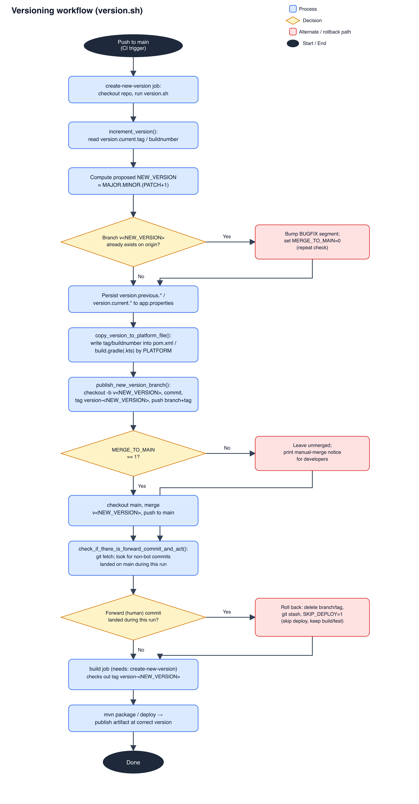

# version.sh



`version.sh` runs in CI (GitHub Actions, `create-new-version` job in `maven-publish.yml`) on every push to `main`. It bumps the project's version, tags it, writes the new version into whatever file the detected platform actually stores its version in (`pom.xml`, `build.gradle(.kts)`, ...), and merges the result back to `main` — no manual version bumps needed.

It expects to run from the root of a checked-out git repo, with `CI_COMMIT_SHA` and `CI_COMMIT_BRANCH` set in the environment.

## Source of truth: `.d3v/app.properties`

Unlike the old design (which read/wrote the version straight out of `pom.xml`), the version is now tracked centrally in a `key=value` file, `.d3v/app.properties`, with four fields:

```
version.previous.tag=0.0.1
version.previous.buildnumber=0
version.current.tag=0.0.2
version.current.buildnumber=1
```

- `version.current.tag` — the semver tag (`MAJOR.MINOR.PATCH[.BUGFIX]`).
- `version.current.buildnumber` — a plain incrementing integer, bumped by 1 every run. Mainly meaningful for Android/KMP, where `versionCode` needs an integer rather than a semver string.
- `version.previous.*` — whatever `version.current.*` was before this run, kept for reference.

New projects get this file scaffolded by `create-project.sh` (`repo-defaults/.all/.d3v/app.properties`), seeded at `version.current.tag=0.0.1` / `buildnumber=0`.

## Version bump logic (`increment_version`)

- Version scheme is `MAJOR.MINOR.PATCH[.BUGFIX]`. By default it increments `PATCH`.
- If a branch `v<MAJOR.MINOR.PATCH>` already exists remotely (someone already published that version), it instead adds/increments a `BUGFIX` segment instead, and in that case it does **not** merge back to `main` — a bugfix version implies the newer patch already had a problem, so a human should merge manually.
- The old `version.current.*` is moved into `version.previous.*`, the new tag/buildnumber become the new `version.current.*` — all persisted back to `app.properties`.

## Per-platform version file (`copy_version_to_platform_file`)

Once the new tag is resolved, it's copied into whatever file the detected platform (via `shell-utils`' `$PLATFORM` detection) actually keeps its version in:

| Platform | File | What's written |
|---|---|---|
| `java` | `pom.xml` | `version.current.tag` into the project's own `<version>` (skips a `<parent>`'s `<version>` if present; works with or without a `<parent>` block) |
| `android` / `kmp` | `build.gradle.kts` or `build.gradle` | `versionName` = `version.current.tag`, `versionCode` = `version.current.buildnumber` (handles both Kotlin and Groovy DSL styles) |
| `ios` | — | not wired up yet |

Both `pom.xml`/`build.gradle` edits are done directly with `awk`/`sed` rather than shelling out to `mvn versions:set` or a Gradle task, to avoid JVM startup cost on every run.

## Branch / tag / merge flow

1. `create_branch_and_set_version` prep + `copy_version_to_platform_file` edit the working tree (uncommitted).
2. `publish_new_version_branch`: create branch `v<new_version>` off `HEAD` (carrying the uncommitted edits), commit (`Updated version to <new_version>`), tag `version-<new_version>`, push **both** the branch and the tag (pushing a branch does *not* push unrelated tags — each needs its own explicit push).
3. If this was a plain patch bump (not a bugfix), `finalize_version_merge` checks out `main`, merges the new version branch into it, and pushes.
4. Either way, `check_if_there_is_forward_commit_and_act` checks whether a non-bot commit landed on `origin/main` while the version bump was running. If so, it assumes a race occurred, deletes the branch/tag it just created, and sets `SKIP_DEPLOY=1` in `create-new-version.env` — so the pipeline still builds/tests but skips the deploy step.

The resolved version is written to `create-new-version.env` as `BUILD_VERSION=<new_version>`. The workflow reads this and exposes it as a job output so the `build` job can check out the exact tag `create-new-version` just pushed — `build`'s checkout otherwise defaults to the commit that triggered the run, which is *before* this version bump ever happened.

## File layout

- `version.sh` — thin orchestrator: sources `utils/version-utils.sh`, then calls `increment_version` → `copy_version_to_platform_file` → `publish_new_version_branch` → `finalize_version_merge` in sequence.
- `utils/version-utils.sh` — all the functions above, plus the `app.properties` `get_version_field`/`set_version_field` helpers. Sources `shell-utils/utils.sh` itself.
- `../shell-utils/` — shared across all scripts in this repo: constants (`constants.sh`), git helpers (`util_git.sh`, eg. `branch_exists`), and the `$PLATFORM` detection (`util_resolve-platform.sh`) that `copy_version_to_platform_file` dispatches on.

## Known limitations

- `git checkout -b v<version>` will fail if that branch already exists locally (not just remotely) — not currently handled.
- `ios` platform detection works, but there's no version-file writer for it yet (no Info.plist/xcodeproj template exists in `repo-defaults` yet either).
